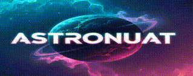

<h2 align="left">Hi 👋 I'm Logan</h2>

###

  

###

  

###

  
  
  
  
  
  

###

<picture>
  <source media="(prefers-color-scheme: dark)" srcset="https://raw.githubusercontent.com/phdbuilds/phdbuilds/output/github-snake-dark.svg" />
  <source media="(prefers-color-scheme: light)" srcset="https://raw.githubusercontent.com/phdbuilds/phdbuilds/output/github-snake.svg" />
  
</picture>

###

###

🔭 Always looking up 📚 Always learning 🌱 Always growing  WGU Cybersecurity

###

 

###
